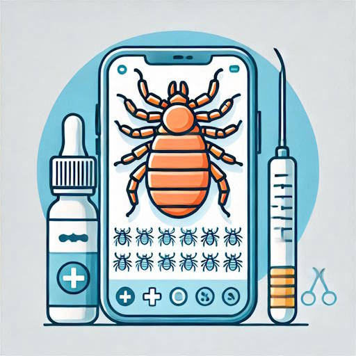

	
	<h1>Vaške Removal Service</h1>
	<h3>Website for Vaške Removal Service, with tips, hints and tricks to help with headlice removal.</h3>
	 
	<h4><a href="https://vaske.me">Open Website</a></h4>

 
 

# Dreams

This project was generated with [Angular CLI](https://github.com/angular/angular-cli) version 18.2.9.

## Development server

Run `ng serve` for a dev server. Navigate to `http://localhost:4200/`. The application will automatically reload if you change any of the source files.

## Code scaffolding

Run `ng generate component component-name` to generate a new component. You can also use `ng generate directive|pipe|service|class|guard|interface|enum|module`.

## Build

Run `ng build` to build the project. The build artifacts will be stored in the `dist/` directory.

## Running unit tests

Run `ng test` to execute the unit tests via [Karma](https://karma-runner.github.io).

## Running end-to-end tests

Run `ng e2e` to execute the end-to-end tests via a platform of your choice. To use this command, you need to first add a package that implements end-to-end testing capabilities.

## Further help

To get more help on the Angular CLI use `ng help` or go check out the [Angular CLI Overview and Command Reference](https://angular.dev/tools/cli) page.

# Notes

Here’s how a Dream Journal app could work:

Key Features:
Dream Entry:

Users can write detailed entries about their dreams.

Option to add tags for recurring themes, emotions, or specific symbols (e.g., flying, falling, animals).

Voice Recording:

Allow users to record their dream as an audio entry immediately upon waking up, which they can later transcribe if they wish.

Dream Analysis:

Provide simple tools or integrate with existing APIs to analyze common dream symbols and themes.

Offer insights and possible meanings based on the user's tagged entries.

Daily Reminders:

Send gentle reminders to users to record their dreams each morning.

Mood and Sleep Tracking:

Integrate with mood and sleep tracking to correlate dream patterns with daily life.

Users can log their mood and sleep quality, and see trends and connections with their dreams.

Dream Sharing:

Option to share dreams anonymously within the app community for feedback or discussion.

Users can comment on and react to shared dreams.

Search and Filter:

Search function to find specific dreams by keywords or tags.

Filter dreams by date, theme, or other criteria.

Cloud Sync and Backup:

Ensure that user entries are backed up and synced across devices.

Customizable Themes:

Allow users to choose the app's appearance to make the journaling experience personal and pleasant.

Security:

Implement security measures like passwords, fingerprint, or facial recognition to protect user privacy.

How It Works:
Wake and Record:

Upon waking up, the user opens the app and quickly jots down or records their dream.

Tag and Analyze:

They can tag the dream with relevant themes or symbols.

The app provides immediate feedback or stores the dream for later analysis.

Daily Reflection:

Users can reflect on their dreams and compare them with previous entries.

Insights into patterns or recurring themes might offer personal revelations.

Community Interaction:

If the user wishes, they can share their dream anonymously in the app's community section.

Engage with others' dreams, offering and receiving feedback.

Track Trends:

Over time, users can see trends and patterns in their dreams related to their mood, sleep quality, and daily experiences.

Building such an app could help people better understand their subconscious and gain insights into their lives. Plus, it’s a fascinating project that merges creative design with meaningful functionality! What do you think? 🌟